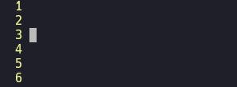
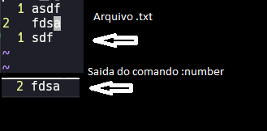
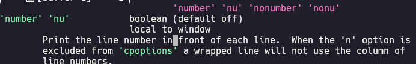

## Ambiente de configuração

Diferente do VIM, o Neovim organiza sua árvore de diretórios em outro local. Enquanto que o VIM utiliza o arquivo `.vimrc` no seu diretório **$HOME**, o Neovim utiliza o diretório ` $HOME/.config/nvim` para armazenar as suas configurações no Linux, e ` $HOME/.AppData/Local/nvim` no Windows.

## Estrutura de pastas

Como vimos, por padrão o Neovim utilizará o diretório ` $HOME/.config/nvim`, então todos os nossos arquivos de configurações deverão ficar nessa pasta.

Ao iniciar, o Neovim irá buscar por um arquivo chamado ***init.vim*** neste diretório padrão. Esse arquivo será o primeiro arquivo que o Neovim irá carregar, então ele que devemos usar para configurações.

A partir do momento que temos um arquivo ***init.vim*** nesse diretório, podemos organizar as pastas e o arquivos da maneira que querermos. Nesse repositório, eu irei sugerir uma maneira de organizar suas configurações tanto em VIM Script, quanto em Lua (a configuração com Lua será nos módulos finais).

Então, vamos organizar as pastas da seguinte maneira:

```
$HOME/.config/nvim
|
|__init.vim
|__mappings.vim
|__plug.vim
|
|__plugins/outros_arquivos
```

Ou seja, o diretório raiz dessa ilustração é o `$HOME/.config/nvim`. Os arquivos `init.vim, mappings.vim e plug.vim` irão ficar na raiz do diretório. Além disso, teremos uma pasta chamada `plugins` que é onde iremos armazenar arquivos de configurações de Plugins instalados (iremos abordar instalações de plugins nos próximos módulos).

## Configurações

Como foi dito nos primeiros artigos, o Neovim compartilha das mesmas configurações do VIM, então se você tem algumas configurações no seu arquivo `.vimrc`, você pode utiliza-las no Neovim.

Eu irei compartilhar algumas configurações do VIM que eu acho importante, porém caso você se interesse mais pelo assunto, temos o repositório [vim4noobs](https://github.com/luanmateuz/vim4noobs) que aborda [configurações](https://github.com/luanmateuz/vim4noobs/blob/master/02-intermediario/configurando-vim.md) mais a fundo.

Para iniciar configurando o seu Neovim, abra o arquivo **init.vim** (de preferência já abra o arquivo no próprio Neovim, assim você irá conseguir perceber as diferenças gradualmente. Lembrando que para abrir um arquivo no Neovim digite: **nvim "nome_do_arquivo"**) e adicione a seguinte linha e após isso feche o Neovim: 

`set number` 

Agora, abra-o novamente e você verá que já é possível ver o número das linhas do arquivo.



Agora adicione as seguintes linhas:

```
set relativenumber
set clipboard+=unnamed
```

Com essas linhas, o Neovim irá mostrar a linha em que você está e as linhas relativas a ela (isso ajuda na movimentação do Neovim). Além disso, setando o clipboard dessa maneira, podemos copiar e colar texto do **clipboard** do SO direto do terminal.

## Definições das configurações

Cada item das configurações do VIM/Neovim possui uma definição na documentação. Podemos inspecionar cada um deles entrando com o comando `:h "nome_da_configuração"`. Isso será útil nos módulos finais, mas como estamos abordando configurações agora, acho interessante comentar.

Como teste, entre com o comando `:h :number`. 



Utilizando esse comando você verá o que o comando **:number** faz, e, como podemos ver, o comando number informa a linha em que o cursor se encontra, além do seu conteúdo.

Porém, temos uma maneira de inspecionar as configurações que botamos nos arquivos VIM Script precedidas pelo comando `set`, elas também podem ser consultadas com o comando **:h**, porém a configuração a ser consultada deve estar entre aspas simples.

Entre com o seguinte comando no seu Neovim para entendermos melhor:

`:h 'number'`

Não confunda. A configuração ***number*** (que é precedida pela keyword **set** no arquivo de configuração) não está sendo usada no mesmo contexto do **COMANDO ***:number*****, neste caso, quando entramos com o comando `:h 'number'` nós estamos consultando as características e atributos da configuração **number** (aquela mesma que botamos no arquivo, como **set number**).

Saida do comando `:h 'number'`:



Com essa definição, nós observamos algumas coisas importantes. Primeiro a configuração **number** aceita valores [booleanos](https://github.com/DantasB/CSharp4Noobs/blob/master/docs/3-B%C3%A1sico/02-Tipos-de-vari%C3%A1veis.md), e também é apresentado que tipo de configuração o **number** é, onde, como podemos ver pela imagem, é do tipo **local to window**. Nós iremos utilizar bastante o comando `:h 'configuração'` nos módulos intermediário e avançado. Lá abordaremos o que é esse **local to window** que temos na definição.

No próximo artigo nós iremos aprofundar nas configurações.

<div style="display: flex; justify-content: space-between;">
    <p>
        <a href="./instalacao.md"><- Voltar para - Instalação</a>
    </p>
    <p>
        <a href="./aprofundando-configuracoes.md">Próximo artigo - Aprofundando nas configurações -></a>
    </p>
</div>
