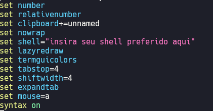
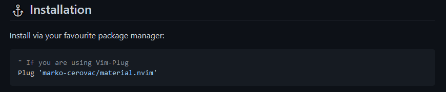
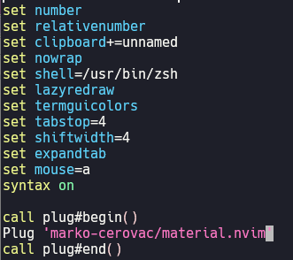
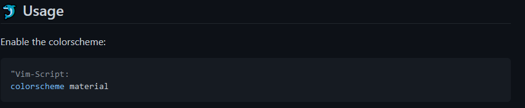
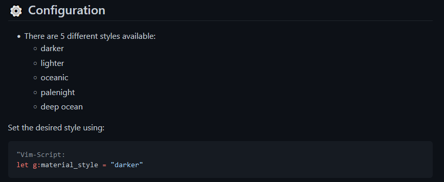

## Aprofundando nos Plugins

Até o momento nós não instalamos nenhum Plugin, apenas demos setup em algumas configurações.

Por enquanto, nosso arquivo init.vim está assim:



Assim como no artigo de configuração, eu irei recomender Plugins essênciais e importantes. Sinta-se livre para procurar por Plugins que você achar (pesquisas simples no Google).

Bom, nosso Neovim ainda está com o padrão de cores que vem por default. Como primeiro Plugin, vamos mudar um pouquinho o esquema de cores.

Se você veio do VIM, os Plugins que você instalou até então foram feitos em **VIM Script**, mas como estamos no Neovim, vamos buscar por temas feitos em **Lua** para instalarmos. Um dos meus temas preferidos (acabei gostando por causa das lives do [danielhe4rt](https://www.twitch.tv/danielhe4rt)) é o Material Palenight, então ele que iremos instalar.

Como foi dito no início do módulo, o Neovim é compatível com o VIM em tudo, porém ele nos dá a possibilidade de configurar e fazer tudo em **LUA**. Esse é o caso do Plugin [material.nvim](https://github.com/marko-cerovac/material.nvim). Apesar do `vim-plug` (nosso gerenciador de Plugins) ser feito em VIM Script, nós podemos instalar Plugins feito em **LUA** tranquilamente.

Com uma rápida pesquisa com `material neovim` no **Google**, encontramos o repositório do [material.nvim](https://github.com/marko-cerovac/material.nvim).

Como eu tinha dito no último artigo, devemos ler a documentação do Plugin afim de entender como utilizá-lo. No caso do **material.nvim**, ele nos dá informações extras sobre compatibilidade com outros Plugins além de um Preview de como o tema ficará após aplicado.



A documentação nos dá uma única linha para instalarmos o Plugin utilizando nosso gerenciador de Plugins. Como vimos, o **vim-plug** nos diz para entrarmos com todos os Plugins que querermos instalar entre o `begin` e o `end`. Então vamos adicionar essa linha utilizando o esquema de instalação do `vim-plug` no nosso arquivo de configuração **init.vim**. Com isso então, nosso arquivo de configuração ficará assim:



Agora com a linha do Plugin adicionada no arquivo de configuração, devemos rodar o comando `:PlugInstall` como vimos no módulo anterior para instalarmos o Plugin.

Ainda seguindo a documentação, devemos "setar" o esquema de cores material no arquivo de configuração.



Então vamos apenas adicionar essa linha embaixo das últimas configurações que fizermos: `colorscheme material`.

Agora, ao reiniciar seu Neovim, você verá que o esquema de cores mudará, porém ainda não será o esquema Palenight. O Plugin **material.nvim** irá instalar alguns dos esquemas de cores mais famosos do Material Theme. Olhando a documentação do **material.nvim** novamente, podemos ver que nós podemos alterar o esquema de cores do Material definindo uma variável global.



Como queremos o esquema Palenight, iremos usar: `let g:material_style = "palenight"`. Bote essa linha **ACIMA** da configuração de **colorscheme** para evitar problemas futuros. Agora, ao reniciar o Neovim, você verá que o esquema de cores mudará para o Palenight.

Agora adicione os seguintes Plugins no seu arquivo de configuração entre as linhas do `vim-plug`:

```
Plug 'tpope/vim-surround'
Plug 'windwp/nvim-autopairs'
```

Lembre de rodar o comando `:PlugInstall` para instalar os Plugins.

O VIM Surround irá te auxiliar trocar caractéres que abram e fecham para outros rapidamente. Então se você tiver o seguinte caso: `console.log('Hello, world!')`, poderá trocar as aspas simples pela aspas duplas usando: `cs '"` (cs, depois aperte aspas simples no seu teclado e após isso aspas duplas). Ele funciona com chaves, colchetes e parênteses também.

O Autopairs irá completar qualquer caractér que necessita ser fechado automaticamente.

No próximo capítulo iremos preparar o nosso diretório para instalarmos mais Plugins essênciais.

<div style="display: flex; justify-content: space-between;">
    <p align="left">
        <a href="./plugins.md"><- Voltar para - Plugins</a>
    </p>
    <p align="right">
        <a href="./organizando-diretorio.md">Próximo artigo - Organizando o diretório -></a>
    </p>
</div>