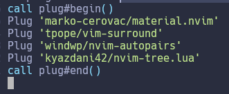

## Organizando diretório do Neovim

Nos próximos artigos, nós iremos começar a instalar Plugins que dependem de configurações para funcionar da melhor maneira. Para isso, precisamos antes melhorar o nosso diretório, pois por enquanto só temos o arquivo **init.vim** e ainda por cima todo bagunçado.

Como vimos no artigo sobre [Ambiente de configuração](ambiente-de-configuracao.md), nós iremos organizar o diretório da seguinte maneira enquanto estivermos usando VIM Script para configurar o Neovim:

```
$HOME/.config/nvim
|
|__init.vim
|__mappings.vim
|__plug.vim
|
|__plugins/outros_arquivos
```

Por enquanto, tempos apenas o init.vim. Para criar o arquivo `plug.vim` e `mappings.vim`, entre no terminal e faça: `touch plug.vim` e `touch mappings.vim`. O arquivo `plug.vim` irá armazenar o trecho de código da instalação dos Plugins do `vim-plug`. Enquanto isso, o arquivo `mappings.vim` irá armazenar os Mapeamentos que iremos fazer nos próximos artigos.

Com os arquivos novos criados, vamos referenciá-los no arquivo principal **init.vim**. Para isso, adicione as seguintes linhas:

```
runtime ./plug.vim
runtime ./mappings.vim
```

Agora retire todas as linhas de Plugins no arquivo `init.vim` e adicione no arquivo `plug.vim`. Fazendo isso, o arquivo `init.vim` e o arquivo `plug.vim` irão ficar assim respectivamente:

init.vim


plug.vim



Pra garantir, rode `:PlugInstall` e veja que não irá retornar nenhum erro.

Agora crie a pasta `plugins` com: `mkdir plugins`. A pasta `plugins` será usada nos próximos artigos quando nós configurarmos Plugins feito em Lua.

Dessa maneira, conseguimos organizar o diretório de uma maneira mais organizada e preparada para as configurações futuras.

<div style="display: flex; justify-content: space-between;">
    <p align="left">
        <a href="./aprofundando-plugins.md"><- Voltar para - Aprofundando nos Plugins</a>
    </p>
</div>
