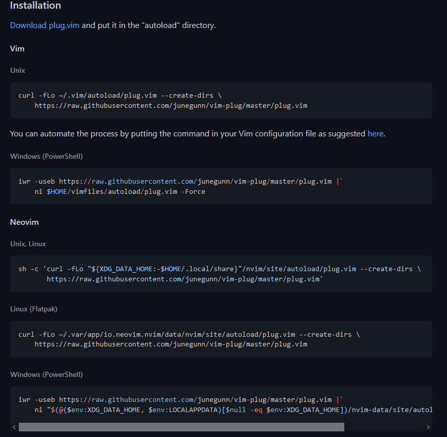
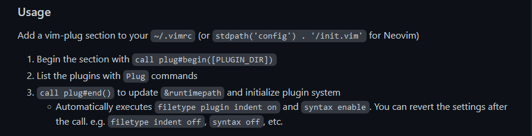
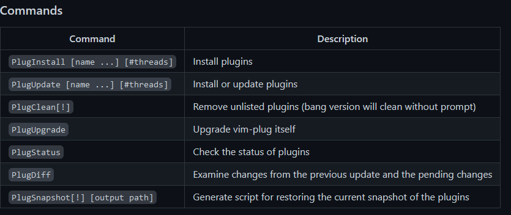

## Plugins

Nós iremos abordar Plugins e suas configurações de forma profunda para o Neovim nesse repositório. Porém caso você queira saber um pouco mais sobre Plugins do VIM (que também funcionam no Neovim), pode consultar o repositório [vim4noobs](https://github.com/luanmateuz/vim4noobs).

Assim como o VIM, o Neovim permite que usuários criem seus próprios Plugins e disponibilizem para a comunidade. Muitas vezes usuários que vieram de outros editores de texto que não permitam tantas configurações profundas, ou que facilitam bastante para o usuário e que não dê controle sobre os Plugins e suas configurações, acabam não lendo a documentação do mesmo. O fato do Neovim te dar controle 100% sobre o seu editor de texto, faz com que muitas vezes seja recomendado a leitura da documentação do Plugin que queremos instalar, pois só assim poderemos usufruir ao máximo dele. E essa é a minha recomendação, leiam sempre a documentação de tudo que você for fazer no Neovim.

Durante os próximos artigos, nós iremos destacar partes importantes das documentações, pois se você ainda não ter o costume de ler ou pesquisar nelas, poderão pegar o "jeito" no futuro (isso vale para Docs de linguagens de prorgamação também).

### Gerenciadores de Plugins

Há muitos gerenciadores de Plugins disponíveis para o VIM/Neovim. Nós iremos começar pelo gerenciador `vim plug` (que também tem disponível para VIM), pois ele é feito em VIM Script e será mais "fácil" de entender por enquanto. Nos próximos módulos, nós iremos portar toda nossa configuração para **Lua**, inclusive os nossos Plugins e gerenciador de Plugins.

**Obs:** apesar de possuir outros gerenciadores de Plugins para o VIM/Neovim, nós iremos usar o `vim plug` pelo fato dele ser mais fácil de entender.

Acessando o [repositório do vim plug](https://github.com/junegunn/vim-plug), podemos ver uma seção que explica como ele funciona logo no começo, tal como os prós de utiliza-lo. Logo abaixo, encontramos a parte de instalação.

#### Instalação do vim plug

Não tem segredo nessa parte, como vimos antes, apenas siga a documentação, pois ela já nos entrega tudo pronto.

Escolha o campo que condiz com o seu Sistema Operacional (Unix/Linux é para MacOS/Linux e derivados). Como podemos ver no print, temos versões para o VIM e para o Neovim, nesse caso devemos escolher Neovim.

Lembre-se que o Neovim procura pelo arquivo **init.vim** no diretório padrão sempre que iniciar, então é lá que devemos pôr as configurações que o `vim-plug` nos der.

Como podemos ver, o `vim-plug` explica que devemos pôr todos os Plugins que querermos instalar entre `call plug#begin()` e `call plug#end()` no nosso arquivo de configuração **init.vim**.

Além disso, devemos usar o comando **:PlugInstall** para instalar os Plugins, como diz a documentação do VIM Plug.

Nesse artigo não entraremos em quais Plugins instalar, apenas na definição e instalação de um gerenciador de Plugins.

    

        <a href="./aprofundando-configuracoes.md"><- Voltar para - Aprufndando nas configurações</a>
    

